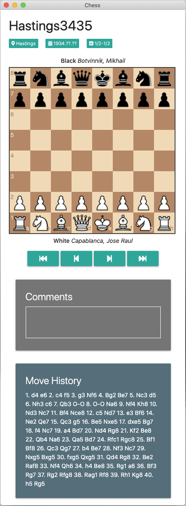

# electron-chess

Welcome to Electron Chess. Review previous games and play your own games as a way to complement your chess study.

# Dependencies

Electron Chess makes use of the following libraries:

- Chess.js - <https://github.com/jhlywa/chess.js>
- Chessboard.js - <https://github.com/oakmac/chessboardjs>

# Screenshots

### Installation

- `npm install`
- `npm run start`

### Building binaries

In order to build Electron Chess from source, follow the installation instructions above, then use one of the following commands to create binaries:

- `npm run package-mac`
- `npm run package-win`
- `npm run package-linux`
