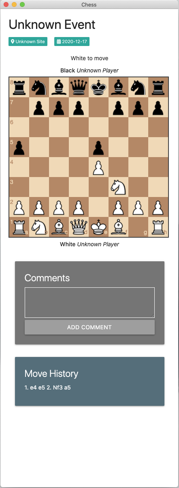

# electron-chess

Welcome to Electron Chess. Review previous games and play your own games as a way to complement your chess study.

### Dependencies

Electron Chess makes use of the following libraries:

- Chess.js - <https://github.com/jhlywa/chess.js>
- Chessboard.js - <https://github.com/oakmac/chessboardjs>

### Screenshots

<table border="0">
    <tr>
        <td align="center">
            
        </td>
        <td>
            <ul>
                <li>Load a game from an existing PGN file (Cmd/Ctrl+O)</li>
                <li>Start your own game (Cmd/Ctrl+N)</li>
                <li>Save a game that you have started and completed (Cmd/Ctrl+S)</li>
                <li>Close a game (Cmd/Ctrl+C)</li>
            </ul>
        </td>
    </tr>
    <tr>
        <td>
            Step through existing games with the previous/next and to beginning/to end arrows. Use shortcuts to navigate through existing games: Shift+Right Arrow, Shift+Left Arrow, Right Arrow, Left Arrow.
        </td>
        <td align="center">
            
        </td>
    </tr>
    <tr>
        <td align="center">
            
        </td>
        <td>
            Start your own games to follow along with a game in an article or a book. Add comments when you want to note something about the state of the games at that point. Save the game later once it's complete.
        </td>
    </tr>
</table>

### Installation

- `npm install`
- `npm run start`

### Building binaries

In order to build Electron Chess from source, follow the installation instructions above, then use one of the following commands to create binaries:

- `npm run package-mac`
- `npm run package-win`
- `npm run package-linux`
